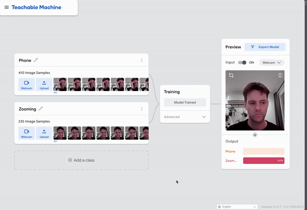

# Observant Systems

Jessica Hsiao (dh779), Irene Wu (yw2785)


For lab this week, we focus on creating interactive systems that can detect and respond to events or stimuli in the environment of the Pi, like the Boat Detector we mentioned in lecture. 
Your **observant device** could, for example, count items, find objects, recognize an event or continuously monitor a room.

This lab will help you think through the design of observant systems, particularly corner cases that the algorithms need to be aware of.

<details>
<summary><strong>Prep (Click to Expand)</strong></summary>

1.  Install VNC on your laptop if you have not yet done so. This lab will actually require you to run script on your Pi through VNC so that you can see the video stream. Please refer to the [prep for Lab 2](https://github.com/FAR-Lab/Interactive-Lab-Hub/blob/-/Lab%202/prep.md#using-vnc-to-see-your-pi-desktop).
2.  Install the dependencies as described in the [prep document](prep.md). 
3.  Read about [OpenCV](https://opencv.org/about/),[Pytorch](https://pytorch.org/), [MediaPipe](https://mediapipe.dev/), and [TeachableMachines](https://teachablemachine.withgoogle.com/).
4.  Read Belloti, et al.'s [Making Sense of Sensing Systems: Five Questions for Designers and Researchers](https://www.cc.gatech.edu/~keith/pubs/chi2002-sensing.pdf).

### For the lab, you will need:
1. Pull the new Github Repo
1. Raspberry Pi
1. Webcam 

### Deliverables for this lab are:
1. Show pictures, videos of the "sense-making" algorithms you tried.
1. Show a video of how you embed one of these algorithms into your observant system.
1. Test, characterize your interactive device. Show faults in the detection and how the system handled it.
</details>

## Overview
Building upon the paper-airplane metaphor (we're understanding the material of machine learning for design), here are the four sections of the lab activity:

A) [Play](#part-a)

B) [Fold](#part-b)

C) [Flight test](#part-c)

D) [Reflect](#part-d)

---
## Part A: Play with different sense-making algorithms.

<details>

<summary><strong>Part A content (Click to expand)</strong></summary>

#### Pytorch for object recognition

For this first demo, you will be using PyTorch and running a MobileNet v2 classification model in real time (30 fps+) on the CPU. We will be following steps adapted from [this tutorial](https://pytorch.org/tutorials/intermediate/realtime_rpi.html).


To get started, install dependencies into a virtual environment for this exercise as described in [prep.md](prep.md).

Make sure your webcam is connected.

You can check the installation by running:

```
python -c "import torch; print(torch.__version__)"
```

If everything is ok, you should be able to start doing object recognition. For this default example, we use [MobileNet_v2](https://arxiv.org/abs/1801.04381). This model is able to perform object recognition for 1000 object classes (check [classes.json](classes.json) to see which ones.

Start detection by running  

```
python infer.py
```

The first 2 inferences will be slower. Now, you can try placing several objects in front of the camera.

Read the `infer.py` script and become familiar with the code. You can change the video resolution and frames per second (FPS). You may also use the weights of the larger pre-trained mobilenet_v3_large model, as described [here](https://pytorch.org/tutorials/intermediate/realtime_rpi.html#model-choices).

#### More classes

[PyTorch supports transfer learning](https://pytorch.org/tutorials/beginner/transfer_learning_tutorial.html), so you can fine‑tune and transfer learn models to recognize your own objects. It requires extra steps, so we won't cover it here.

For more details on transfer learning and deployment to embedded devices, see Deep Learning on Embedded Systems: A Hands‑On Approach Using Jetson Nano and Raspberry Pi (Tariq M. Arif). [Chapter 10](https://onlinelibrary.wiley.com/doi/10.1002/9781394269297.ch10) covers transfer learning for object detection on desktop, and [Chapter 15](https://onlinelibrary.wiley.com/doi/10.1002/9781394269297.ch15) describes moving models to the Pi using ONNX.

### Machine Vision With Other Tools
The following sections describe tools ([MediaPipe](#mediapipe) and [Teachable Machines](#teachable-machines)).

#### MediaPipe

A established open source and efficient method of extracting information from video streams comes out of Google's [MediaPipe](https://mediapipe.dev/), which offers state of the art face, face mesh, hand pose, and body pose detection.


To get started, install dependencies into a virtual environment for this exercise as described in [prep.md](prep.md):

Each of the installs will take a while, please be patient. After successfully installing mediapipe, connect your webcam to your Pi and use **VNC to access to your Pi**, open the terminal, and go to Lab 5 folder and run the hand pose detection script we provide:
(***it will not work if you use ssh from your laptop***)


```
(venv-ml) pi@ixe00:~ $ cd Interactive-Lab-Hub/Lab\ 5
(venv-ml) pi@ixe00:~ Interactive-Lab-Hub/Lab 5 $ python hand_pose.py
```

Try the two main features of this script: 1) pinching for percentage control, and 2) "[Quiet Coyote](https://www.youtube.com/watch?v=qsKlNVpY7zg)" for instant percentage setting. Notice how this example uses hardcoded positions and relates those positions with a desired set of events, in `hand_pose.py`. 

Consider how you might use this position based approach to create an interaction, and write how you might use it on either face, hand or body pose tracking.

(You might also consider how this notion of percentage control with hand tracking might be used in some of the physical UI you may have experimented with in the last lab, for instance in controlling a servo or rotary encoder.)

#### Moondream Vision-Language Model

[Moondream](https://www.ollama.com/library/moondream) is a lightweight vision-language model that can understand and answer questions about images. Unlike the classification models above, Moondream can describe images in natural language and answer specific questions about what it sees.

To use Moondream, first make sure Ollama is running and pull the model:
```bash
ollama pull moondream
```

Then run the simple demo script:
```bash
python moondream_simple.py
```

This will capture an image from your webcam and let you ask questions about it in natural language. Note that vision-language models are slower than classification models (responses may take up to minutes on a Raspberry Pi). There are newer models like [LFM2-VL](https://huggingface.co/LiquidAI/LFM2-VL-450M-GGUF), but many are very recent and not yet optimized for embedded devices.

**Design consideration**: Think about how slower response times change your interaction design. What kinds of observant systems benefit from thoughtful, delayed responses rather than real-time classification? Consider systems that monitor over longer time periods or provide periodic summaries rather than instant feedback.

#### Teachable Machines
Google's [TeachableMachines](https://teachablemachine.withgoogle.com/train) is very useful for prototyping with the capabilities of machine learning. We are using [a python package](https://github.com/MeqdadDev/teachable-machine-lite) with tensorflow lite to simplify the deployment process.


To get started, install dependencies into a virtual environment for this exercise as described in [prep.md](prep.md):

After installation, connect your webcam to your Pi and use **VNC to access to your Pi**, open the terminal, and go to Lab 5 folder and run the example script:
(***it will not work if you use ssh from your laptop***)


```
(venv-tml) pi@ixe00:~ Interactive-Lab-Hub/Lab 5 $ python tml_example.py
```


Next train your own model. Visit [TeachableMachines](https://teachablemachine.withgoogle.com/train), select Image Project and Standard model. The raspberry pi 4 is capable to run not just the low resource models. Second, use the webcam on your computer to train a model. *Note: It might be advisable to use the pi webcam in a similar setting you want to deploy it to improve performance.*  For each class try to have over 150 samples, and consider adding a background or default class where you have nothing in view so the model is trained to know that this is the background. Then create classes based on what you want the model to classify. Lastly, preview and iterate. Finally export your model as a 'Tensorflow lite' model. You will find an '.tflite' file and a 'labels.txt' file. Upload these to your pi (through one of the many ways such as [scp](https://www.raspberrypi.com/documentation/computers/remote-access.html#using-secure-copy), sftp, [vnc](https://help.realvnc.com/hc/en-us/articles/360002249917-VNC-Connect-and-Raspberry-Pi#transferring-files-to-and-from-your-raspberry-pi-0-6), or a connected visual studio code remote explorer).



Include screenshots of your use of Teachable Machines, and write how you might use this to create your own classifier. Include what different affordances this method brings, compared to the OpenCV or MediaPipe options.

#### (Optional) Legacy audio and computer vision observation approaches
In an earlier version of this class students experimented with observing through audio cues. Find the material here:
[Audio_optional/audio.md](Audio_optional/audio.md). 
Teachable machines provides an audio classifier too. If you want to use audio classification this is our suggested method. 

In an earlier version of this class students experimented with foundational computer vision techniques such as face and flow detection. Techniques like these can be sufficient, more performant, and allow non discrete classification. Find the material here:
[CV_optional/cv.md](CV_optional/cv.md).

</details>


## Part B: Construct a simple interaction.

<details>
<summary><strong>Instruction (Click to Expand)</strong></summary>

* Pick one of the models you have tried, and experiment with prototyping an interaction.
* This can be as simple as the boat detector shown in lecture.
* Try out different interaction outputs and inputs.

</details>


### Simple Interaction Prototype: Smile Together

For this prototype, we selected the BlazeFace (short-range) face detection model and extended it to support multi-person smiling detection. The goal was to explore how computer vision can shape playful social interaction in a shared space.

#### Interaction Concept

The system acts as a “smile check” camera, designed for situations like taking group photos. When multiple people are in the frame:

- If everyone is smiling, the camera remains calm (ready to take the picture).

- If any person is not smiling, the system triggers feedback—such as playing a sound or flashing an LED—to gently nudge the group to smile before the photo is taken.

This creates a playful, cooperative interaction: instead of one person asking “okay, is everyone smiling?”, the device automatically enforces the moment.

#### Input

- Live webcam feed
- BlazeFace detects multiple faces simultaneously
- A simple heuristic (prototype stage) estimates a "smile score" for each face (in future versions this can be replaced by a trained smile classifier)

#### Output / Feedback
The system experiments with different feedback modes when not all detected faces are smiling:

- **Audio signal**: Soft “ding” tone as a reminder
- **LED blink**: Simulated LED flashes on screen (or physical LED if connected)
- **Screen overlay**: Red border + text: “Someone isn’t smiling yet!”
- **Visual smile sync bar**: Progress bar showing overall “smile status” before approval

#### Interaction Logic

- Track each detected face independently
- Assign a filtered “smile probability” to each face
- Average group smile score
- Trigger feedback when at least one person falls below the smile threshold

#### Prototype rule:

If any face has smile score < 0.65 for more than 1 second → trigger feedback

### Part C: Test the interaction prototype

<details>
<summary><strong>Instruction (Click to Expand)</strong></summary>

Now flight test your interactive prototype and **note down your observations**:
For example:
1. When does it what it is supposed to do?
2. When does it fail?
3. When it fails, why does it fail?
4. Based on the behavior you have seen, what other scenarios could cause problems?

**\*\*\*Think about someone using the system. Describe how you think this will work.\*\*\***
1. Are they aware of the uncertainties in the system?
2. How bad would they be impacted by a miss classification?
3. How could change your interactive system to address this?
4. Are there optimizations you can try to do on your sense-making algorithm.

</details>

#### When does it do what it’s supposed to do?

- When users are facing the camera and they are within detection range, the system will detect their faces and figure out whether all users are smiling or not.

- When all users are smiling, it will trigger the systems to display fireworks and play music.

- When some people are smiling and others aren't, the screen will display a message about “cheer your friend up.” Also, it would play a piece of music to cheer people up.

#### When does it fail?

- The systems occasionally fail when:

    - The light in the place is uneven or dim, leading some people’s faces to be partially shadowed. It may lead to wrong detections.
    - Some users turning their head or partially exiting the frame may cause the system to fail because it can not fully detect people’s faces.
    - Some users may have subtle smiles (e.g., small smirks), which are misclassified as neutral.
    - Glasses or facial hair obscure key landmarks, causing errors in emotion detection.

#### Why does it fail?

- BlazeFace and MediaPipe’s face mesh models are optimized for frontal, well-lit faces; off-axis angles reduce confidence.
The smile detection logic likely relies on mouth corner distance or AU12 activation thresholds, which can be sensitive to lighting and camera resolution.

- Frame rate fluctuations can cause inconsistent detections, especially if webcam performance drops.

- Large groups or background faces triggering false detections.

- People wearing masks or using virtual backgrounds.

- Different emotional expressions (e.g., laughter or talking) being mistaken for smiles.

- Network latency or computation delay causing asynchronous reactions (music/fireworks triggering late).

***Think about someone using the system. Describe how you think this will work.***

1. Are they aware of the uncertainties in the system?
2. How bad would they be impacted by a miss classification?
3. How could change your interactive system to address this?
4. Are there optimizations you can try to do on your sense-making algorithms?

**User Experience: How It Might Work**

- When a group gathers for a photo, the Smile-Check Camera becomes a “smart reminder” rather than a passive device. The participants position themselves, look at the screen, and notice live visual feedback. If everyone smiles, the system stays quiet, which is implicitly approving the moment.

- If someone’s expression is neutral or missing, the audio “ding” or red border gently nudges them to adjust. This playful loop continues until all detected smiles reach the threshold, prompting laughter and coordination. The system subtly shifts social responsibility from a human photographer to an automated, impartial “smile referee,” making the act of getting ready part of the fun.

**Awareness of System Uncertainties**

- Users are partially aware of the system’s uncertainties, though not technically. They may notice that the camera sometimes fails to recognize subtle smiles or misreads a talking face as neutral. In these moments, people tend to attribute quirks to “the system being picky” rather than technical limitations.

- This ambiguity actually contributes to playfulness. It invites the group to exaggerate their smiles or “test” the system. However, frequent false detections could frustrate users if they are trying to capture a real photo quickly.


#### Impact of Misclassification

Misclassifications have low practical impact but moderate experiential impact:

- **Low stakes**: The worst outcome is a short delay or a false “not smiling yet” alert.

- **Playful context**: Small errors often make people laugh or over-perform expressions, reinforcing the cooperative aspect.

- **Potential downside**: If errors persist (e.g., one person never registers as smiling), it can create mild annoyance or exclude that participant from the “success” moment.

#### Design Improvements

To make the system more robust and user-friendly:

- **Calibration Step**: Let users briefly record their neutral and smiling faces so the threshold (0.65) adjusts to individual facial features.

- **Confidence Averaging**: Smooth the smile probability over several frames (e.g., exponential moving average) to reduce flickering classifications.

- **Visual Feedback Clarity**: Instead of a red “error” state, show encouraging messages like “Almost there!” or a filling progress bar to sustain engagement.

- **Lighting Adaptation**: Integrate brightness normalization or display a “too dark” hint if the camera confidence drops.

### Part D: Characterize your own Observant system

<details>
<summary><strong>Instruction (Click to Expand)</strong></summary>

Now that you have experimented with one or more of these sense-making systems **characterize their behavior**.
During the lecture, we mentioned questions to help characterize a material:
* What can you use X for?
* What is a good environment for X?
* What is a bad environment for X?
* When will X break?
* When it breaks how will X break?
* What are other properties/behaviors of X?
* How does X feel?


</details>

**What can you use Smile Together for?**

- **Group picture**: One possible circumstance to use this application is when taking a group picture. It is difficult to check if everyone is smiling or looking at the camera at the same time, and with Smile Together, it automatically monitors all faces in the frame and notifies the group if someone is not smiling yet. This makes taking group photos smoother, faster, and more fun.

- **Shared social moments**: Another circumstance is during shared social moments, such as events or celebrations, where people want to maintain a positive group expression. The system can be used as a playful prompt to encourage group engagement, cooperation, and synchronized expressions.

- **Team-building**: It can also function as a team-building activity. For example, a workplace or social club could use the system as a “smile synchronizing challenge,” where participants must coordinate their expressions to unlock an animation or audio reward.

- **Photo booth**: It could be used in self-service photo booths at events or public spaces. Instead of needing a photographer to announce “say cheese,” the system guides participants automatically and facilitates a joyful interactive experience.

#### What is a good/bad environment for Smile Together?

The accuracy of the detection largely depends on the face recognition performance. To ensure reliable results, the environment should be well-lit, have minimal visual clutter, and place users at an appropriate distance from the camera. On the other hand, if the environment is messy, busy, or does not have sufficient light, it might lead to poor detection results.

#### When will Smile Together break and how will it break?

Smile Together currently uses a heuristic-based smile detection method on cropped face regions instead of a fully trained smile-classification model. Because of this, the system can struggle in situations where facial features are harder to interpret. It may fail in low-light environments, when users are too far from the camera, partially turned away, or moving quickly. In these cases, the system may miss real smiles or incorrectly flag someone as “not smiling.” It can also break when people have subtle or closed-mouth smiles, are talking, or cover their mouths, since the heuristic may not treat those as valid smile cues. Overall, these breakdowns usually appear as false negatives (failing to detect a real smile) or inconsistent triggering when the scene is noisy or ambiguous.

**Common breakdown cases**

1. Poor lighting or occlusion
    - Failure: Faces aren't reliably detected or mouth shapes are misread.
    - Cause: Low contrast, shadows, or users turning away.
    - Result: Missed smiles or false “not smiling” feedback.

2. Subtle or non-standard smiles
    - Failure: Genuine smiles aren't recognized.
    - Cause: Expression differences (e.g., closed-mouth smiles, cultural variation).
    - Result: Inconsistent smile detection across users.

3. Camera angle or distance issues
    - Failure: Detection works unevenly across the frame.
    - Cause: Smaller or angled faces reduce confidence.
    - Result: Distant or partially angled users may not “count” even if smiling.

#### How does Smile Together feel?

Smile Together feels playful and enjoyable for users. Unlike a regular camera, it encourages everyone in the frame to be more aware of each other, turning the photo-taking moment into a fun group interaction. People often laugh, make eye contact, and try to figure out who isn’t smiling enough yet, which creates a light, cooperative atmosphere and turns photo-taking into a more joyful experience.

### Part 2.

Following exploration and reflection from Part 1, finish building your interactive system, and demonstrate it in use with a video.

**\*\*\*Include a short video demonstrating the finished result.\*\*\***

Video Link: # Observant Systems

Jessica Hsiao (dh779), Irene Wu (yw2785)


For lab this week, we focus on creating interactive systems that can detect and respond to events or stimuli in the environment of the Pi, like the Boat Detector we mentioned in lecture. 
Your **observant device** could, for example, count items, find objects, recognize an event or continuously monitor a room.

This lab will help you think through the design of observant systems, particularly corner cases that the algorithms need to be aware of.

<details>
<summary><strong>Prep (Click to Expand)</strong></summary>

1.  Install VNC on your laptop if you have not yet done so. This lab will actually require you to run script on your Pi through VNC so that you can see the video stream. Please refer to the [prep for Lab 2](https://github.com/FAR-Lab/Interactive-Lab-Hub/blob/-/Lab%202/prep.md#using-vnc-to-see-your-pi-desktop).
2.  Install the dependencies as described in the [prep document](prep.md). 
3.  Read about [OpenCV](https://opencv.org/about/),[Pytorch](https://pytorch.org/), [MediaPipe](https://mediapipe.dev/), and [TeachableMachines](https://teachablemachine.withgoogle.com/).
4.  Read Belloti, et al.'s [Making Sense of Sensing Systems: Five Questions for Designers and Researchers](https://www.cc.gatech.edu/~keith/pubs/chi2002-sensing.pdf).

### For the lab, you will need:
1. Pull the new Github Repo
1. Raspberry Pi
1. Webcam 

### Deliverables for this lab are:
1. Show pictures, videos of the "sense-making" algorithms you tried.
1. Show a video of how you embed one of these algorithms into your observant system.
1. Test, characterize your interactive device. Show faults in the detection and how the system handled it.
</details>

## Overview
Building upon the paper-airplane metaphor (we're understanding the material of machine learning for design), here are the four sections of the lab activity:

A) [Play](#part-a)

B) [Fold](#part-b)

C) [Flight test](#part-c)

D) [Reflect](#part-d)

---
## Part A: Play with different sense-making algorithms.

<details>

<summary><strong>Part A content (Click to expand)</strong></summary>

#### Pytorch for object recognition

For this first demo, you will be using PyTorch and running a MobileNet v2 classification model in real time (30 fps+) on the CPU. We will be following steps adapted from [this tutorial](https://pytorch.org/tutorials/intermediate/realtime_rpi.html).


To get started, install dependencies into a virtual environment for this exercise as described in [prep.md](prep.md).

Make sure your webcam is connected.

You can check the installation by running:

```
python -c "import torch; print(torch.__version__)"
```

If everything is ok, you should be able to start doing object recognition. For this default example, we use [MobileNet_v2](https://arxiv.org/abs/1801.04381). This model is able to perform object recognition for 1000 object classes (check [classes.json](classes.json) to see which ones.

Start detection by running  

```
python infer.py
```

The first 2 inferences will be slower. Now, you can try placing several objects in front of the camera.

Read the `infer.py` script and become familiar with the code. You can change the video resolution and frames per second (FPS). You may also use the weights of the larger pre-trained mobilenet_v3_large model, as described [here](https://pytorch.org/tutorials/intermediate/realtime_rpi.html#model-choices).

#### More classes

[PyTorch supports transfer learning](https://pytorch.org/tutorials/beginner/transfer_learning_tutorial.html), so you can fine‑tune and transfer learn models to recognize your own objects. It requires extra steps, so we won't cover it here.

For more details on transfer learning and deployment to embedded devices, see Deep Learning on Embedded Systems: A Hands‑On Approach Using Jetson Nano and Raspberry Pi (Tariq M. Arif). [Chapter 10](https://onlinelibrary.wiley.com/doi/10.1002/9781394269297.ch10) covers transfer learning for object detection on desktop, and [Chapter 15](https://onlinelibrary.wiley.com/doi/10.1002/9781394269297.ch15) describes moving models to the Pi using ONNX.

### Machine Vision With Other Tools
The following sections describe tools ([MediaPipe](#mediapipe) and [Teachable Machines](#teachable-machines)).

#### MediaPipe

A established open source and efficient method of extracting information from video streams comes out of Google's [MediaPipe](https://mediapipe.dev/), which offers state of the art face, face mesh, hand pose, and body pose detection.


To get started, install dependencies into a virtual environment for this exercise as described in [prep.md](prep.md):

Each of the installs will take a while, please be patient. After successfully installing mediapipe, connect your webcam to your Pi and use **VNC to access to your Pi**, open the terminal, and go to Lab 5 folder and run the hand pose detection script we provide:
(***it will not work if you use ssh from your laptop***)


```
(venv-ml) pi@ixe00:~ $ cd Interactive-Lab-Hub/Lab\ 5
(venv-ml) pi@ixe00:~ Interactive-Lab-Hub/Lab 5 $ python hand_pose.py
```

Try the two main features of this script: 1) pinching for percentage control, and 2) "[Quiet Coyote](https://www.youtube.com/watch?v=qsKlNVpY7zg)" for instant percentage setting. Notice how this example uses hardcoded positions and relates those positions with a desired set of events, in `hand_pose.py`. 

Consider how you might use this position based approach to create an interaction, and write how you might use it on either face, hand or body pose tracking.

(You might also consider how this notion of percentage control with hand tracking might be used in some of the physical UI you may have experimented with in the last lab, for instance in controlling a servo or rotary encoder.)

#### Moondream Vision-Language Model

[Moondream](https://www.ollama.com/library/moondream) is a lightweight vision-language model that can understand and answer questions about images. Unlike the classification models above, Moondream can describe images in natural language and answer specific questions about what it sees.

To use Moondream, first make sure Ollama is running and pull the model:
```bash
ollama pull moondream
```

Then run the simple demo script:
```bash
python moondream_simple.py
```

This will capture an image from your webcam and let you ask questions about it in natural language. Note that vision-language models are slower than classification models (responses may take up to minutes on a Raspberry Pi). There are newer models like [LFM2-VL](https://huggingface.co/LiquidAI/LFM2-VL-450M-GGUF), but many are very recent and not yet optimized for embedded devices.

**Design consideration**: Think about how slower response times change your interaction design. What kinds of observant systems benefit from thoughtful, delayed responses rather than real-time classification? Consider systems that monitor over longer time periods or provide periodic summaries rather than instant feedback.

#### Teachable Machines
Google's [TeachableMachines](https://teachablemachine.withgoogle.com/train) is very useful for prototyping with the capabilities of machine learning. We are using [a python package](https://github.com/MeqdadDev/teachable-machine-lite) with tensorflow lite to simplify the deployment process.


To get started, install dependencies into a virtual environment for this exercise as described in [prep.md](prep.md):

After installation, connect your webcam to your Pi and use **VNC to access to your Pi**, open the terminal, and go to Lab 5 folder and run the example script:
(***it will not work if you use ssh from your laptop***)


```
(venv-tml) pi@ixe00:~ Interactive-Lab-Hub/Lab 5 $ python tml_example.py
```


Next train your own model. Visit [TeachableMachines](https://teachablemachine.withgoogle.com/train), select Image Project and Standard model. The raspberry pi 4 is capable to run not just the low resource models. Second, use the webcam on your computer to train a model. *Note: It might be advisable to use the pi webcam in a similar setting you want to deploy it to improve performance.*  For each class try to have over 150 samples, and consider adding a background or default class where you have nothing in view so the model is trained to know that this is the background. Then create classes based on what you want the model to classify. Lastly, preview and iterate. Finally export your model as a 'Tensorflow lite' model. You will find an '.tflite' file and a 'labels.txt' file. Upload these to your pi (through one of the many ways such as [scp](https://www.raspberrypi.com/documentation/computers/remote-access.html#using-secure-copy), sftp, [vnc](https://help.realvnc.com/hc/en-us/articles/360002249917-VNC-Connect-and-Raspberry-Pi#transferring-files-to-and-from-your-raspberry-pi-0-6), or a connected visual studio code remote explorer).


Include screenshots of your use of Teachable Machines, and write how you might use this to create your own classifier. Include what different affordances this method brings, compared to the OpenCV or MediaPipe options.

#### (Optional) Legacy audio and computer vision observation approaches
In an earlier version of this class students experimented with observing through audio cues. Find the material here:
[Audio_optional/audio.md](Audio_optional/audio.md). 
Teachable machines provides an audio classifier too. If you want to use audio classification this is our suggested method. 

In an earlier version of this class students experimented with foundational computer vision techniques such as face and flow detection. Techniques like these can be sufficient, more performant, and allow non discrete classification. Find the material here:
[CV_optional/cv.md](CV_optional/cv.md).

</details>


## Part B: Construct a simple interaction.

<details>
<summary><strong>Instruction (Click to Expand)</strong></summary>

* Pick one of the models you have tried, and experiment with prototyping an interaction.
* This can be as simple as the boat detector shown in lecture.
* Try out different interaction outputs and inputs.

</details>


### Simple Interaction Prototype: Smile Together

For this prototype, we selected the BlazeFace (short-range) face detection model and extended it to support multi-person smiling detection. The goal was to explore how computer vision can shape playful social interaction in a shared space.

#### Interaction Concept

The system acts as a “smile check” camera, designed for situations like taking group photos. When multiple people are in the frame:

- If everyone is smiling, the camera remains calm (ready to take the picture).

- If any person is not smiling, the system triggers feedback—such as playing a sound or flashing an LED—to gently nudge the group to smile before the photo is taken.

This creates a playful, cooperative interaction: instead of one person asking “okay, is everyone smiling?”, the device automatically enforces the moment.

#### Input

- Live webcam feed
- BlazeFace detects multiple faces simultaneously
- A simple heuristic (prototype stage) estimates a "smile score" for each face (in future versions this can be replaced by a trained smile classifier)

#### Output / Feedback
The system experiments with different feedback modes when not all detected faces are smiling:

- **Audio signal**: Soft “ding” tone as a reminder
- **LED blink**: Simulated LED flashes on screen (or physical LED if connected)
- **Screen overlay**: Red border + text: “Someone isn’t smiling yet!”
- **Visual smile sync bar**: Progress bar showing overall “smile status” before approval

#### Interaction Logic

- Track each detected face independently
- Assign a filtered “smile probability” to each face
- Average group smile score
- Trigger feedback when at least one person falls below the smile threshold

#### Prototype rule:

If any face has smile score < 0.65 for more than 1 second → trigger feedback

### Part C: Test the interaction prototype

<details>
<summary><strong>Instruction (Click to Expand)</strong></summary>

Now flight test your interactive prototype and **note down your observations**:
For example:
1. When does it what it is supposed to do?
2. When does it fail?
3. When it fails, why does it fail?
4. Based on the behavior you have seen, what other scenarios could cause problems?

**\*\*\*Think about someone using the system. Describe how you think this will work.\*\*\***
1. Are they aware of the uncertainties in the system?
2. How bad would they be impacted by a miss classification?
3. How could change your interactive system to address this?
4. Are there optimizations you can try to do on your sense-making algorithm.

</details>

#### When does it do what it’s supposed to do?

- When users are facing the camera and they are within detection range, the system will detect their faces and figure out whether all users are smiling or not.

- When all users are smiling, it will trigger the systems to display fireworks and play music.

- When some people are smiling and others aren't, the screen will display a message about “cheer your friend up.” Also, it would play a piece of music to cheer people up.

#### When does it fail?

- The systems occasionally fail when:

    - The light in the place is uneven or dim, leading some people’s faces to be partially shadowed. It may lead to wrong detections.
    - Some users turning their head or partially exiting the frame may cause the system to fail because it can not fully detect people’s faces.
    - Some users may have subtle smiles (e.g., small smirks), which are misclassified as neutral.
    - Glasses or facial hair obscure key landmarks, causing errors in emotion detection.

#### Why does it fail?

- BlazeFace and MediaPipe’s face mesh models are optimized for frontal, well-lit faces; off-axis angles reduce confidence.
The smile detection logic likely relies on mouth corner distance or AU12 activation thresholds, which can be sensitive to lighting and camera resolution.

- Frame rate fluctuations can cause inconsistent detections, especially if webcam performance drops.

- Large groups or background faces triggering false detections.

- People wearing masks or using virtual backgrounds.

- Different emotional expressions (e.g., laughter or talking) being mistaken for smiles.

- Network latency or computation delay causing asynchronous reactions (music/fireworks triggering late).

***Think about someone using the system. Describe how you think this will work.***

1. Are they aware of the uncertainties in the system?
2. How bad would they be impacted by a miss classification?
3. How could change your interactive system to address this?
4. Are there optimizations you can try to do on your sense-making algorithms?

**User Experience: How It Might Work**

- When a group gathers for a photo, the Smile-Check Camera becomes a “smart reminder” rather than a passive device. The participants position themselves, look at the screen, and notice live visual feedback. If everyone smiles, the system stays quiet, which is implicitly approving the moment.

- If someone’s expression is neutral or missing, the audio “ding” or red border gently nudges them to adjust. This playful loop continues until all detected smiles reach the threshold, prompting laughter and coordination. The system subtly shifts social responsibility from a human photographer to an automated, impartial “smile referee,” making the act of getting ready part of the fun.

**Awareness of System Uncertainties**

- Users are partially aware of the system’s uncertainties, though not technically. They may notice that the camera sometimes fails to recognize subtle smiles or misreads a talking face as neutral. In these moments, people tend to attribute quirks to “the system being picky” rather than technical limitations.

- This ambiguity actually contributes to playfulness. It invites the group to exaggerate their smiles or “test” the system. However, frequent false detections could frustrate users if they are trying to capture a real photo quickly.


#### Impact of Misclassification

Misclassifications have low practical impact but moderate experiential impact:

- **Low stakes**: The worst outcome is a short delay or a false “not smiling yet” alert.

- **Playful context**: Small errors often make people laugh or over-perform expressions, reinforcing the cooperative aspect.

- **Potential downside**: If errors persist (e.g., one person never registers as smiling), it can create mild annoyance or exclude that participant from the “success” moment.

#### Design Improvements

To make the system more robust and user-friendly:

- **Calibration Step**: Let users briefly record their neutral and smiling faces so the threshold (0.65) adjusts to individual facial features.

- **Confidence Averaging**: Smooth the smile probability over several frames (e.g., exponential moving average) to reduce flickering classifications.

- **Visual Feedback Clarity**: Instead of a red “error” state, show encouraging messages like “Almost there!” or a filling progress bar to sustain engagement.

- **Lighting Adaptation**: Integrate brightness normalization or display a “too dark” hint if the camera confidence drops.

### Part D: Characterize your own Observant system

<details>
<summary><strong>Instruction (Click to Expand)</strong></summary>

Now that you have experimented with one or more of these sense-making systems **characterize their behavior**.
During the lecture, we mentioned questions to help characterize a material:
* What can you use X for?
* What is a good environment for X?
* What is a bad environment for X?
* When will X break?
* When it breaks how will X break?
* What are other properties/behaviors of X?
* How does X feel?


</details>

**What can you use Smile Together for?**

- **Group picture**: One possible circumstance to use this application is when taking a group picture. It is difficult to check if everyone is smiling or looking at the camera at the same time, and with Smile Together, it automatically monitors all faces in the frame and notifies the group if someone is not smiling yet. This makes taking group photos smoother, faster, and more fun.

- **Shared social moments**: Another circumstance is during shared social moments, such as events or celebrations, where people want to maintain a positive group expression. The system can be used as a playful prompt to encourage group engagement, cooperation, and synchronized expressions.

- **Team-building**: It can also function as a team-building activity. For example, a workplace or social club could use the system as a “smile synchronizing challenge,” where participants must coordinate their expressions to unlock an animation or audio reward.

- **Photo booth**: It could be used in self-service photo booths at events or public spaces. Instead of needing a photographer to announce “say cheese,” the system guides participants automatically and facilitates a joyful interactive experience.

#### What is a good/bad environment for Smile Together?

The accuracy of the detection largely depends on the face recognition performance. To ensure reliable results, the environment should be well-lit, have minimal visual clutter, and place users at an appropriate distance from the camera. On the other hand, if the environment is messy, busy, or does not have sufficient light, it might lead to poor detection results.

#### When will Smile Together break and how will it break?

Smile Together currently uses a heuristic-based smile detection method on cropped face regions instead of a fully trained smile-classification model. Because of this, the system can struggle in situations where facial features are harder to interpret. It may fail in low-light environments, when users are too far from the camera, partially turned away, or moving quickly. In these cases, the system may miss real smiles or incorrectly flag someone as “not smiling.” It can also break when people have subtle or closed-mouth smiles, are talking, or cover their mouths, since the heuristic may not treat those as valid smile cues. Overall, these breakdowns usually appear as false negatives (failing to detect a real smile) or inconsistent triggering when the scene is noisy or ambiguous.

**Common breakdown cases**

1. Poor lighting or occlusion
    - Failure: Faces aren't reliably detected or mouth shapes are misread.
    - Cause: Low contrast, shadows, or users turning away.
    - Result: Missed smiles or false “not smiling” feedback.

2. Subtle or non-standard smiles
    - Failure: Genuine smiles aren't recognized.
    - Cause: Expression differences (e.g., closed-mouth smiles, cultural variation).
    - Result: Inconsistent smile detection across users.

3. Camera angle or distance issues
    - Failure: Detection works unevenly across the frame.
    - Cause: Smaller or angled faces reduce confidence.
    - Result: Distant or partially angled users may not “count” even if smiling.

#### How does Smile Together feel?

Smile Together feels playful and enjoyable for users. Unlike a regular camera, it encourages everyone in the frame to be more aware of each other, turning the photo-taking moment into a fun group interaction. People often laugh, make eye contact, and try to figure out who isn’t smiling enough yet, which creates a light, cooperative atmosphere and turns photo-taking into a more joyful experience.

### Part 2.

Following exploration and reflection from Part 1, finish building your interactive system, and demonstrate it in use with a video.

**\*\*\*Include a short video demonstrating the finished result.\*\*\***

Video Link: https://drive.google.com/file/d/1Ls7duoT8EDv3cmBR8GsxXG--B6gBmLwc/view?usp=drive_link


#### Reflections from Users of Smile Together

Good:
- Most users describe Smile Together as a delightful and surprising experience.
- They enjoy the moment when the system recognizes a shared smile and responds. It feels playful, human, and emotionally rewarding. Many say it creates a sense of connection even in a short interaction.
- It promotes eye contact, timing, and cooperation, turning technology into a social connector.

Bad:
- Users often don’t realize how sensitive the system is to lighting, angles, or timing until they see it fail.
- They sometimes think the system is “judging” them for not smiling “correctly,” which can make them self-conscious.


#### Reflections from Users of Smile Together

Good:
- Most users describe Smile Together as a delightful and surprising experience.
- They enjoy the moment when the system recognizes a shared smile and responds. It feels playful, human, and emotionally rewarding. Many say it creates a sense of connection even in a short interaction.
- It promotes eye contact, timing, and cooperation, turning technology into a social connector.

Bad:
- Users often don’t realize how sensitive the system is to lighting, angles, or timing until they see it fail.
- They sometimes think the system is “judging” them for not smiling “correctly,” which can make them self-conscious.
