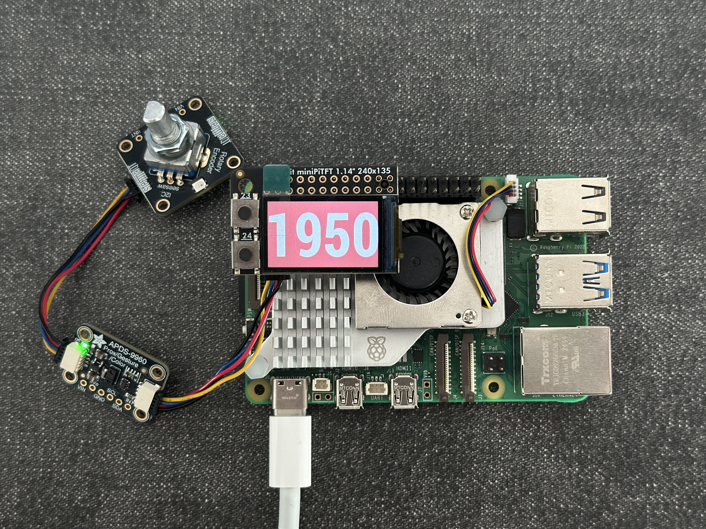
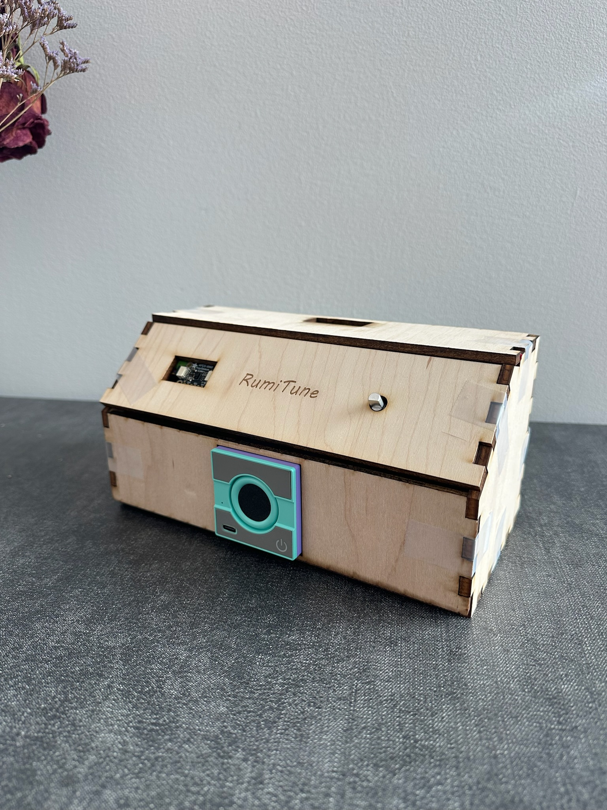
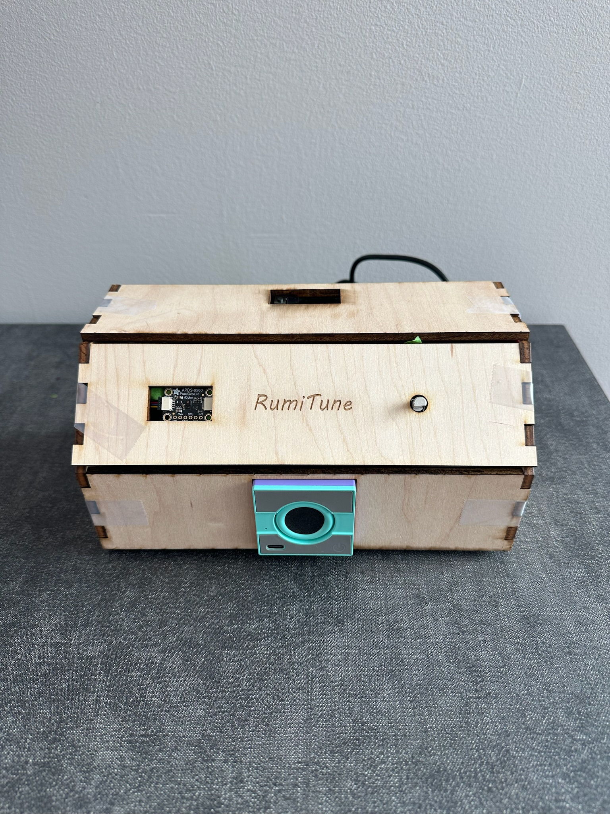
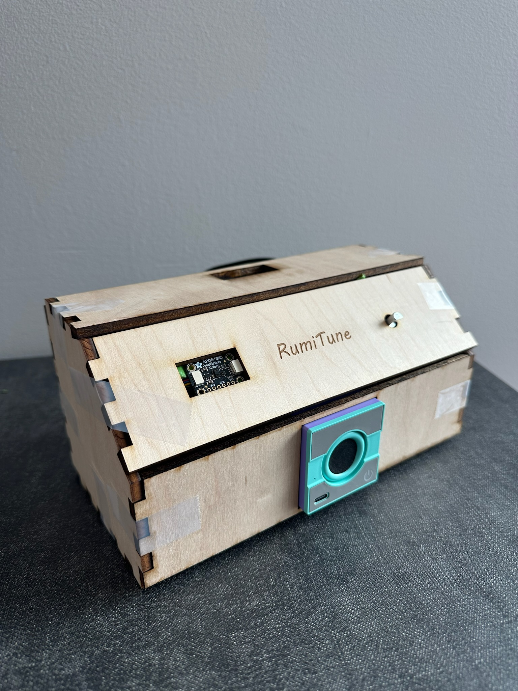
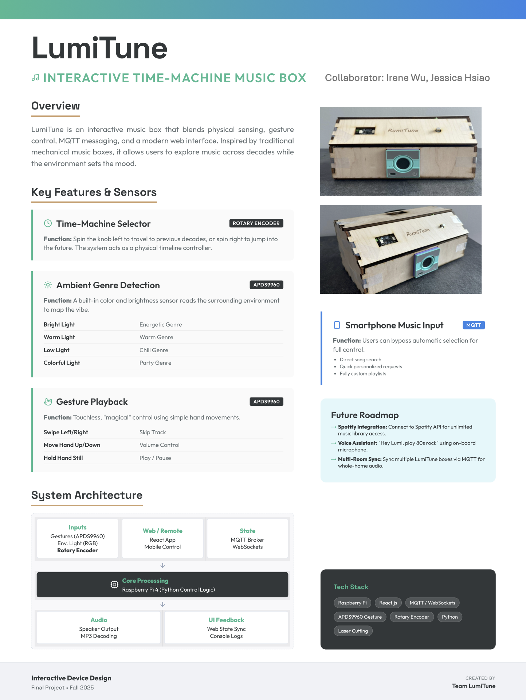

# 🎶 **LumiTune — Sensor-Driven Interactive Music Box**

LumiTune is an immersive, sensor-driven music box that blends **physical interaction**, **environmental sensing**, and **networked control**.

Inspired by traditional mechanical music boxes, LumiTune lets users explore music across decades while the **environment dynamically sets the mood**.

---
## 📝 Project Plan

**⏳ Timeline**

| Milestone | Date | Notes |
| :--- | :--- | :--- |
| **Setup & Box Design** | W1 Nov 15 | Create the storyboard and finalize the interaction flow. Verify that all hardware components and sensors are functioning properly and ready for integration. |
| **Module Development** | W2 Nov 18 | Implement #1 color/brightness detection, #2 gesture controls, and #3 rotary movement modes. |
| **Mobile Control + MQTT Development** | W2 Nov 23 | Implement MQTT messaging for phone; setup MQTT broke, build simple mobile UI to send messages, and implement Pi-side message parsing + fallback logic. |
| **Module Testing + Product Appearance Design** | W3 Nov 26 | Test all modules: verify gesture reliability, color detection, motor modes, MQTT message flow (connect, publish, subscribe, reconnection). |
| **System Integration + Product Outlook Generation** | W3 Dec 1 | Combine all modules into one system; ensure conflict handling and smooth state transitions. Design appearance and use 3D Printer & laser machine to generate product outlook. |
| **User Interaction Testing** | W4 Dec 5 | Conduct user tests to evaluate all functions; test common misuse scenarios. |
| **Final Write-up + Documentation** | W4 Dec 14 | Complete the final report, including functions, architecture diagrams, and final demo preparation. |

**🛡️ Fallback Plans**

* **Gesture Sensor Instability:** If the APDS-9960 sensor misreads inputs, the **Web Controller** serves as the primary backup for volume and track control.
* **Color Sensing Failure:** If lighting conditions cannot be determined, the system defaults to the **"Warm"** genre playlist to ensure continuous audio.
* **Network Disconnection:** If the Wi-Fi or MQTT connection drops, the system enters **Standalone Mode**—local playback and physical sensors continue to function without interruption.
* **Motor Malfunction:** The decorative servo operates asynchronously; if the motor stalls, the **audio engine continues running** unaffected.


---

## 🎥 Demo & Media

**📸 Device overview**

| Hardware | Enclosure - Left | Enclosure - Front | Enclosure - Right |
|--------|--------|--------|--------|
|  |  |  |  |


**🎬 User Testing Video**: [Click to watch](./assets/user_testing.MP4)

---

## 📌 **System Overview**

LumiTune integrates:

✔ Light + color sensing (APDS-9960)  
✔ Gesture recognition (APDS-9960)  
✔ Rotary movement control (Rotary encoder)  
✔ MQTT communication via Mosquitto  
✔ TFT display feedback (ST7789 PiTFT)  
✔ Randomized decade-based music playback (1950s–2020s)  

It runs on a Raspberry Pi with a Bluetooth speaker and PiTFT display.

---

## ✨ **Core Features**

### 🕰 **1. Time-Machine Decade Selector**

Users (or the web UI) choose a decade (1950s–2020s).  
Each playback request selects one track from:

```text
<year>_<genre>_<01..03>.mp3
```

Example: `1960_chill_02.mp3`

---

### 🌈 **2. Environment-Based Genre Detection**

Ambient lighting determines the vibe:

| Environment Condition | Genre |
|----------------------|--------|
| Very dim light | Chill |
| Extremely bright | Party |
| Moderate brightness + warm tone | Warm |
| Moderate brightness + neutral/cool tone | Energetic |

Genre switching occurs **only when conditions remain stable** for several seconds to avoid flicker.

---

### ✋ **3. Gesture Playback Control**

Using APDS-9960:

| Gesture | Action |
|--------|--------|
| Up | Volume up |
| Down | Volume down |
| Left | Previous track |
| Right | Next track |
| Hold (proximity) | Pause/Play toggle |

A short proximity “hold” in front of the sensor toggles pause/play.

---

### 🎛 **4. Rotary Movement + Decade Control**

A rotary encoder controls:

- Decorative servo **movement mode**: Spin Left / Spin Right
- **Decade selection** (turning changes the current decade and triggers a new track).

---

### 📺 **5. TFT Display Feedback**

A PiTFT ST7789 screen shows:

- Background color = current genre/vibe
- Large central text = current decade year (e.g., 1950, 1980, 2020)

Colors are mapped per genre to give a quick, glanceable vibe indication.

--- 

### 📱 **6. Web Controller (React + MQTT)**

A small React web UI lets users:

- Choose decade
- Override genre
- Adjust volume
- Send playback requests

The web page connects to Mosquitto over **MQTT over WebSockets**.

---

## 🗂 **Project Structure**

```
Project/
│
├── backend/
│   ├── main_musicbox.py         # System coordinator (entry point)
│   ├── audio_engine.py          # Playback system (pygame.mixer, track selection)
│   ├── mqtt_controller.py       # MQTT bridge (song requests + status)
│   ├── display_controller.py    # ST7789 TFT display (year + vibe color)
│   ├── sensor_controller.py     # Gestures, light sensing, servo, rotary encoder
│   ├── requirements.txt         # Python dependencies for backend
│   └── __init__.py
│
├── music/                       # MP3 files (organized by decade + genre naming)
│   └── 1950_chill_01.mp3, 1950_chill_02.mp3, ...
│
├── LumiTune-webpage/            # Web UI (React/Vite)
│   ├── public/
│   │   └── config.js            # Defines PI_IP + WS_PORT for MQTT over WebSocket
│   ├── src/
│   │   ├── components/
│   │   ├── guidelines/
│   │   ├── styles/
│   │   ├── App.tsx
│   │   └── main.tsx
│   └── package.json
│
├── assets/
│   ├── poster.png
│   ├── hardware.jpg
│   ├── enclosure_1.jpg
│   ├── enclosure_2.jpg
│   ├── enclosure_3.jpg
│   ├── user_testing.mp4
|
└── README.md
```

---

## ⚙ **Setup Instructions**

### 1️⃣ Install System Dependencies

```bash
sudo apt update
sudo apt install mpg123 espeak mosquitto
```

---

### 2️⃣ Install Python Dependencies

Backend core:

```bash
pip install -r backend/requirements.txt
```

Sensor stack:

```bash
pip install pygame adafruit-blinka adafruit-circuitpython-apds9960 adafruit-circuitpython-seesaw adafruit-circuitpython-servokit
```

Frontend:

```bash
cd LumiTune-webpage
npm install
```


---

### 3️⃣ Start MQTT Broker

```bash
sudo systemctl start mosquitto
```

---

## ▶️ **Launching LumiTune**

### ⚠️ IMPORTANT — Stop Pi Screen Driver First

Before running the display controller, **stop the default TFT framebuffer service** or it will conflict:

```bash
sudo systemctl stop piscreen.service
```

---

### ✅ Start the entire backend

```bash
cd backend
python3 main_musicbox.py
```

---

## 🌐 **Launching the Web UI**

### Start web controller

```bash
cd LumiTune-webpage
npm run dev -- --host
```

Access from any device on the same network:

```
http://<PI-IP>:3000/
```

Ensure `public/config.js` matches your Pi:

```javascript
window.MUSICBOX_CONFIG = {
  PI_IP: "10.xx.xx.xx",
  WS_PORT: 9001
};
```

---

## 🔊 **Audio File Organization**

MP3 naming format:

```
<year>_<genre>_<track>.mp3
```

Examples:

- 1950_chill_01.mp3  
- 1980_party_03.mp3  

Supported genres:

✔ chill  
✔ warm  
✔ energetic  
✔ party  

Each decade folder contains 12 total files (3 tracks × 4 genres).

---

## 🖼 Project Poster



---

🎉 Enjoy building and extending LumiTune!
